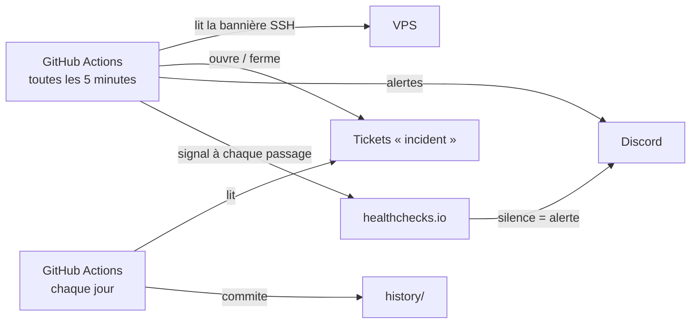

# uptime-probe

*[English version](README.md)*

Une sonde de disponibilité externe pour mon VPS, qui tourne sur GitHub Actions.

Entre juillet et septembre 2026, mon serveur s'est arrêté cinq fois sans laisser la moindre trace dans ses propres journaux, une fois pendant près de 16 heures. Un serveur ne peut pas signaler sa propre panne : cette sonde le surveille donc de l'extérieur.

- **Toutes les 5 minutes**, elle lit la bannière SSH du serveur : un port ouvert ne suffit pas, il faut que le service SSH réponde. Une cible n'est déclarée injoignable qu'après trois échecs, espacés de 10 secondes.
- **Quand le serveur ne répond plus**, elle ouvre un ticket avec l'étiquette [`incident`](../../issues?q=label%3Aincident) et envoie une alerte sur Discord. Quand il répond de nouveau, elle commente le ticket avec la durée de l'arrêt, le ferme et prévient Discord.
- **À chaque passage**, elle signale sa présence à healthchecks.io, qui donne l'alerte si la sonde elle-même s'arrête, par exemple si GitHub suspend ses workflows planifiés.
- **Chaque jour**, elle ajoute une ligne par cible dans [`history/`](history) : nombre d'incidents, minutes d'arrêt, disponibilité.

La liste des tickets forme ainsi un journal public et horodaté des arrêts : la preuve à fournir à l'hébergeur.

## Fonctionnement



| Fichier | Rôle |
|---|---|
| [`targets.json`](targets.json) | Ce qu'on surveille : un nom, un hôte et un port par cible |
| [`scripts/probe.sh`](scripts/probe.sh) | Un contrôle de chaque cible ; ouvre et ferme les incidents |
| [`scripts/summary.sh`](scripts/summary.sh) | Le bilan quotidien, calculé à partir des incidents |
| [`.github/workflows/`](.github/workflows) | Les planifications : sonde toutes les 5 minutes, bilan chaque jour, vérifications à chaque push |

## Mise en place

Les deux secrets sont facultatifs : sans eux, la sonde enregistre les incidents mais n'envoie aucune alerte. Ils s'ajoutent dans *Settings → Secrets and variables → Actions* :

- `DISCORD_WEBHOOK_URL` : le webhook d'un salon Discord privé ;
- `HEALTHCHECKS_PING_URL` : l'adresse de ping d'un contrôle healthchecks.io, avec une période de 5 minutes et un délai de grâce de 10 minutes.

## Lancer la sonde en local

Avec bash, jq et la CLI GitHub connectée, depuis le dépôt :

```bash
DRY_RUN=true scripts/probe.sh
```

`DRY_RUN=true` affiche les actions (tickets, alertes) au lieu de les exécuter.

## Limites

- GitHub peut retarder les workflows planifiés quand sa charge est forte : les arrêts sont horodatés à quelques minutes près, et un arrêt de moins de 5 minutes environ peut passer inaperçu.
- La sonde ouvre une connexion SSH sans s'authentifier : la protection du serveur contre la force brute ne doit pas bannir les adresses de GitHub pour ce motif.
- Elle ne voit le serveur que depuis le réseau de GitHub : une panne limitée à un autre réseau lui échapperait.

## Contexte

Cette sonde fait partie du projet d'infrastructure de mon portfolio : un VPS durci, décrit en code et qui héberge des démos pour 0 €. Toutes les actions sont épinglées par empreinte de commit (SHA) et tenues à jour par Dependabot.

## Licence

[MIT](LICENSE)
