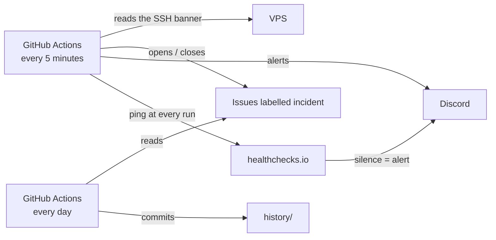

# uptime-probe

*[Version française](README.fr.md)*

An external uptime probe for my VPS, running on GitHub Actions.

Between July and September 2026, my server stopped five times without leaving a single trace in its own logs, once for almost 16 hours. A server cannot report its own outage, so this probe watches it from the outside:

- **every 5 minutes**, it reads the server's SSH banner: an open port is not enough, the SSH daemon must answer. A target counts as down only after three failed attempts, 10 seconds apart;
- **when the server stops answering**, it opens an issue labelled [`incident`](../../issues?q=label%3Aincident) and posts an alert to Discord. When the server answers again, it comments with the outage length, closes the issue and posts again;
- **every run** pings healthchecks.io, which raises an alert if the probe itself stops, for example if GitHub suspends its scheduled workflows;
- **every day**, it appends one line per target to [`history/`](history): incidents, minutes of outage, availability.

The issue list is therefore a public, timestamped log of outages: the evidence to send to the hosting provider.

## How it works



| File | Role |
|---|---|
| [`targets.json`](targets.json) | What to watch: a name, a host and a port per target |
| [`scripts/probe.sh`](scripts/probe.sh) | One check of every target; opens and closes incidents |
| [`scripts/summary.sh`](scripts/summary.sh) | Daily summary, computed from the incidents |
| [`.github/workflows/`](.github/workflows) | Schedules: probe every 5 minutes, summary every day, lint on every push |

## Setup

Both secrets are optional: without them, the probe still records incidents, but sends no alert. Add them in *Settings → Secrets and variables → Actions*:

- `DISCORD_WEBHOOK_URL`: the webhook of a private Discord channel;
- `HEALTHCHECKS_PING_URL`: the ping URL of a healthchecks.io check, with a 5-minute period and a 10-minute grace time.

## Run it locally

With bash, jq and the GitHub CLI logged in, from the repository:

```bash
DRY_RUN=true scripts/probe.sh
```

`DRY_RUN=true` prints the actions (issues, alerts) instead of performing them.

## Limits

- GitHub may delay scheduled runs when its load is high: outages are timestamped to within a few minutes, and outages shorter than about 5 minutes may go unnoticed.
- The probe opens an SSH connection without authenticating. The server's brute-force protection must not ban GitHub's addresses for it.
- It sees the server from GitHub's network only: an outage limited to another network would go unnoticed.

## Context

This probe is part of the infrastructure project of my portfolio: a VPS hardened, described as code and hosting demos for 0 €. All actions are pinned by commit SHA and kept up to date by Dependabot.

## License

[MIT](LICENSE)
